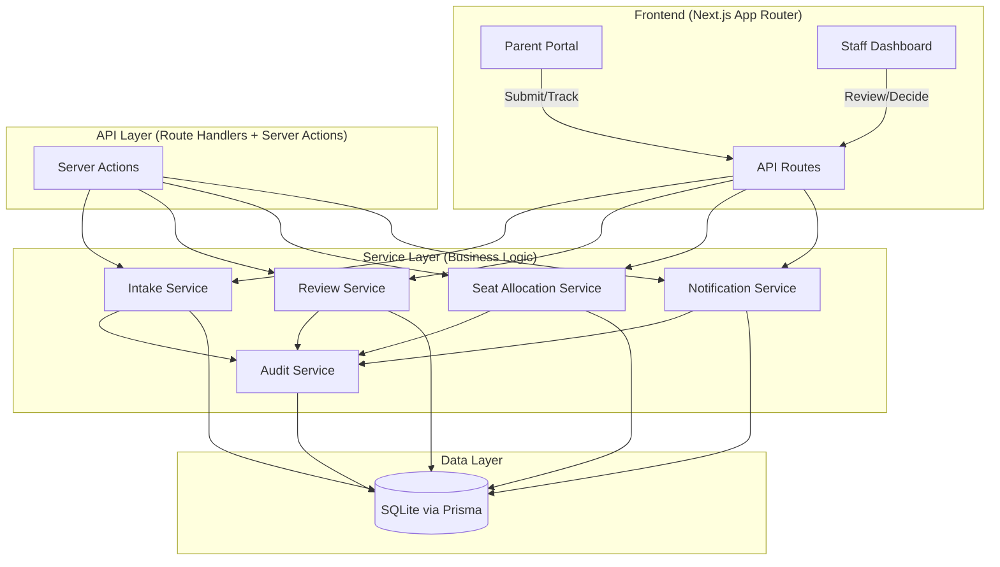
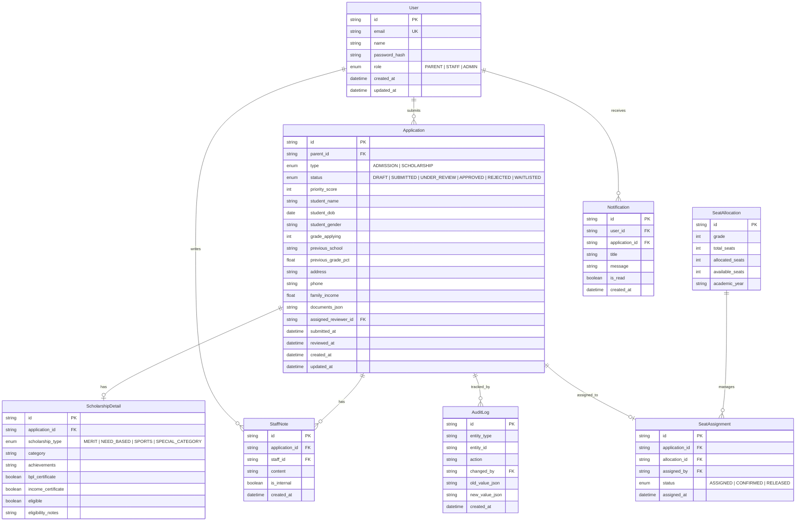

# Government School Admission & Scholarship Portal — Implementation Plan

## Problem Summary

Build an end-to-end system where **parents** apply for school admissions/scholarships and **education staff** review, prioritize, allocate seats, and track decisions — with full audit trail, internal notes, and status visibility.

---

## Tech Stack Decision

| Layer | Technology | Rationale |
|-------|-----------|-----------|
| **Framework** | Next.js 14 (App Router) | Full-stack in one codebase — API routes + SSR + client components |
| **Database** | SQLite via Prisma ORM | Zero-config, file-based, instant setup — perfect for demo |
| **Auth** | NextAuth.js (Credentials) | Role-based auth (Parent vs Staff) with session management |
| **Validation** | Zod + React Hook Form | Type-safe validation on both client and server |
| **Styling** | CSS Modules + CSS Variables | Premium design system without framework dependency |
| **Testing** | Vitest + Testing Library | Fast unit/integration tests |
| **Language** | TypeScript | Type safety, better DX, competition judges love it |

> [!IMPORTANT]
> **Why monolith over microservices?** In a 3-hour window, a well-structured monolith with clear separation of concerns (service layer pattern) delivers the same logical architecture as microservices without the orchestration overhead. The code is organized as if it were microservices (separate service modules) making it trivially extractable later.

---

## Architecture Overview



---

## Database Schema Design



---

## Feature Breakdown & Priority

### 🟢 Phase 1: Foundation (45 min)
| # | Feature | Description |
|---|---------|-------------|
| 1 | Project scaffold | Next.js + Prisma + Auth + CSS design system |
| 2 | Database schema | All models, migrations, seed data |
| 3 | Authentication | Login/Register with role-based routing (Parent ↔ Staff) |
| 4 | Design system | Premium CSS variables, components, responsive grid |

### 🟡 Phase 2: Core Workflows (60 min)
| # | Feature | Description |
|---|---------|-------------|
| 5 | Parent: Submit application | Multi-step form with validation (admission + scholarship) |
| 6 | Parent: Track status | Dashboard showing all applications with status badges |
| 7 | Staff: Review queue | Sortable/filterable list with priority scoring |
| 8 | Staff: Application detail | Full view with approve/reject/waitlist + internal notes |
| 9 | Seat allocation | Grade-wise capacity management and assignment |

### 🔵 Phase 3: Polish & Advanced (45 min)
| # | Feature | Description |
|---|---------|-------------|
| 10 | Scholarship eligibility | Auto-checks based on income, grades, category |
| 11 | Audit trail | Full history of all status changes |
| 12 | Notifications | In-app notification system for status updates |
| 13 | Bulk actions | Staff can approve/reject multiple applications |
| 14 | Dashboard analytics | Approval rates, seat utilization, trends |

### 🟣 Phase 4: Documentation & Testing (30 min)
| # | Feature | Description |
|---|---------|-------------|
| 15 | Unit tests | Service layer tests with Vitest |
| 16 | Integration tests | API route tests |
| 17 | README.md | Setup instructions, architecture, test commands |
| 18 | Documentation | Design philosophy, AI review files, feature docs |

---

## UI Design Philosophy

### Design System
- **Color Palette**: Deep navy primary (`#0f172a`), emerald accent (`#10b981`), warm amber warnings (`#f59e0b`), with glassmorphism cards
- **Typography**: Inter font family — clean, professional, government-appropriate
- **Layout**: Sidebar navigation for staff, clean card-based layout for parents
- **Animations**: Subtle transitions on hover, smooth page transitions, skeleton loaders
- **Responsive**: Mobile-first with fluid breakpoints

### Key UI Components
1. **StatusBadge** — Color-coded pills (Submitted=blue, Under Review=amber, Approved=green, Rejected=red)
2. **PriorityIndicator** — Visual priority scoring with color gradient
3. **ApplicationCard** — Rich card with student info, status, and quick actions
4. **MultiStepForm** — Progressive form with validation per step
5. **DataTable** — Sortable, filterable table for staff queue
6. **StatCard** — Animated counter cards for dashboard metrics
7. **Timeline** — Audit trail visualization
8. **NotificationBell** — Dropdown with unread count badge

---

## Proposed File Structure

```
d:\downloads\vibe_coding\
├── app/
│   ├── (auth)/
│   │   ├── login/page.tsx
│   │   └── register/page.tsx
│   ├── (parent)/
│   │   ├── layout.tsx
│   │   ├── dashboard/page.tsx
│   │   ├── apply/
│   │   │   ├── admission/page.tsx
│   │   │   └── scholarship/page.tsx
│   │   └── applications/[id]/page.tsx
│   ├── (staff)/
│   │   ├── layout.tsx
│   │   ├── dashboard/page.tsx
│   │   ├── review/page.tsx
│   │   ├── review/[id]/page.tsx
│   │   ├── seats/page.tsx
│   │   └── reports/page.tsx
│   ├── api/
│   │   ├── auth/[...nextauth]/route.ts
│   │   ├── applications/route.ts
│   │   ├── applications/[id]/route.ts
│   │   ├── applications/[id]/notes/route.ts
│   │   ├── applications/[id]/status/route.ts
│   │   ├── seats/route.ts
│   │   ├── notifications/route.ts
│   │   └── audit/route.ts
│   ├── layout.tsx
│   └── page.tsx (landing page)
├── components/
│   ├── ui/
│   │   ├── Button.tsx + Button.module.css
│   │   ├── Input.tsx + Input.module.css
│   │   ├── Badge.tsx + Badge.module.css
│   │   ├── Card.tsx + Card.module.css
│   │   ├── Modal.tsx + Modal.module.css
│   │   ├── DataTable.tsx + DataTable.module.css
│   │   ├── Skeleton.tsx + Skeleton.module.css
│   │   └── Toast.tsx + Toast.module.css
│   ├── forms/
│   │   ├── AdmissionForm.tsx
│   │   └── ScholarshipForm.tsx
│   ├── layout/
│   │   ├── Sidebar.tsx
│   │   ├── Header.tsx
│   │   └── NotificationBell.tsx
│   └── features/
│       ├── ApplicationCard.tsx
│       ├── ReviewPanel.tsx
│       ├── SeatManager.tsx
│       ├── AuditTimeline.tsx
│       └── StatsGrid.tsx
├── lib/
│   ├── prisma.ts
│   ├── auth.ts
│   ├── validators.ts (Zod schemas)
│   └── utils.ts
├── services/
│   ├── intake.service.ts
│   ├── review.service.ts
│   ├── seat-allocation.service.ts
│   ├── notification.service.ts
│   └── audit.service.ts
├── prisma/
│   ├── schema.prisma
│   └── seed.ts
├── styles/
│   ├── globals.css (design system + variables)
│   └── animations.css
├── __tests__/
│   ├── services/
│   │   ├── intake.test.ts
│   │   ├── review.test.ts
│   │   └── seat-allocation.test.ts
│   └── api/
│       └── applications.test.ts
├── docs/
│   ├── DEVELOPMENT.md
│   ├── FEATURES.md
│   ├── DESIGN_PHILOSOPHY.md
│   ├── BUSINESS_CONTEXT.md
│   └── ai-reviews/
│       ├── commit-001.md
│       └── ...
├── README.md
├── package.json
├── tsconfig.json
├── next.config.js
└── .env
```

---

## Commit Strategy

| Commit # | Message | Milestone |
|----------|---------|-----------|
| 1 | `feat: initialize Next.js project with TypeScript and Prisma` | Scaffold |
| 2 | `feat: add database schema with all core models and migrations` | Database |
| 3 | `feat: implement authentication with NextAuth.js and role-based routing` | Auth |
| 4 | `feat: create design system with CSS variables, components, and responsive layout` | Design |
| 5 | `feat: implement parent application submission with multi-step form` | Parent Portal |
| 6 | `feat: add parent dashboard with application tracking and status view` | Parent Portal |
| 7 | `feat: build staff review queue with filtering, sorting, and priority` | Staff Portal |
| 8 | `feat: implement staff application review with approve/reject and notes` | Staff Portal |
| 9 | `feat: add seat allocation management and assignment workflow` | Seats |
| 10 | `feat: implement scholarship eligibility checks and review workflow` | Scholarship |
| 11 | `feat: add audit trail, notifications, and bulk actions` | Advanced |
| 12 | `feat: add dashboard analytics with approval rates and trends` | Analytics |
| 13 | `test: add unit and integration tests for service and API layers` | Testing |
| 14 | `docs: add README, development docs, feature docs, and AI review files` | Docs |

---

## User Review Required

> [!IMPORTANT]
> **Key Decision: Authentication Approach**
> I plan to use **NextAuth.js with Credentials provider** (email/password). For the demo, I'll seed the database with pre-created parent and staff accounts so reviewers can immediately log in and test. Is this acceptable, or do you want a different auth approach?

> [!IMPORTANT]
> **Key Decision: Demo Data**
> I'll seed the database with **realistic demo data** — 15-20 sample applications in various states, multiple schools with seat data, and sample scholarship applications. This makes the demo video compelling and the reviewer experience seamless.

> [!IMPORTANT]
> **Key Decision: Landing Page**
> I plan to build a **stunning landing page** as the entry point with hero section, feature highlights, and dual CTA buttons (Parent Login / Staff Login). This creates a strong first impression. Agreed?

---

## Open Questions

1. **Git setup**: Should I initialize a git repository in the workspace and make commits as we go, or will you handle git separately?
2. **Deployment**: Do you need Docker Compose setup, or is local `npm run dev` sufficient for the demo?
3. **Video demo**: Should the app have any specific demo-friendly features (like a "reset demo data" button)?

---

## Verification Plan

### Automated Tests
```bash
npm test              # Run all Vitest tests
npm run test:coverage # Run with coverage report
npx prisma migrate dev # Verify database migrations
npm run build         # Verify production build succeeds
npm run lint          # Verify no linting errors
```

### Manual Verification
- [ ] Parent can register, login, submit admission application
- [ ] Parent can submit scholarship application with eligibility check
- [ ] Parent can view all applications and their statuses
- [ ] Staff can login and see review queue with priorities
- [ ] Staff can review, approve/reject applications with notes
- [ ] Staff can manage seat allocations by grade
- [ ] Staff can assign seats to approved applicants
- [ ] Audit trail records all status changes
- [ ] Notifications appear for status updates
- [ ] Responsive design works on mobile viewport
- [ ] All forms have proper validation and error messages
